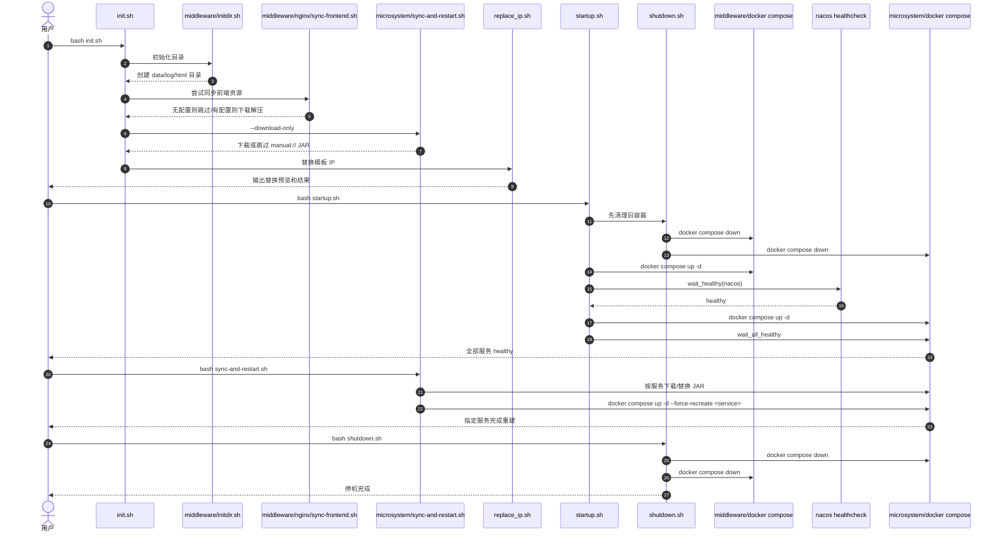

# knowledge-infra

面向 `knowledge-hub` 的部署与运维仓，负责中间件、微服务编排、初始化脚本、JAR 同步、前端资源同步与运行期诊断。

## 仓库定位

- 这是项目B的部署仓，不是业务源码主仓。
- 默认服务对象是项目A `knowledge-hub`。
- 当前主链路围绕 `middleware -> microsystem` 两层展开。

## 当前部署范围

### middleware 核心链路

- `mysql`
- `redis`
- `nacos`
- `elasticsearch`
- `nginx`
- `rocketmq`

说明：

- `MySQL / Redis / Nacos / Elasticsearch` 是当前项目A核心依赖。
- `Nginx / RocketMQ` 已纳入标准部署体系，便于后续扩展。
- 仓库中仍保留部分公司历史目录，如 `tdengine`、`skywalking`、`prometheus`、`xxljob`，但它们不属于当前默认启动链路。

### microsystem 服务清单

- `kb-gateway`
- `kb-auth`
- `kb-content`
- `kb-message`
- `kb-search`

说明：

- `kb-gateway`、`kb-auth` 是当前优先接入服务。
- `kb-content`、`kb-message`、`kb-search` 先按标准骨架预留，具备端口、JAR、日志、健康检查约定，但默认不保证已有可运行 JAR。

## 最简使用流程

1. 进入仓库根目录，执行 `bash init.sh`
2. 执行 `bash startup.sh`
3. 检查 `middleware` 和 `microsystem` 状态
4. 如需更新 JAR，进入 `microsystem` 执行 `bash sync-and-restart.sh`
5. 如需停机，执行 `bash shutdown.sh`

## 主执行流



## 脚本分级

### 核心脚本

这些脚本直接参与部署主链路，建议保留并优先维护。

| 脚本 | 分类 | 当前价值 | 主要作用 |
| --- | --- | --- | --- |
| `init.sh` | 核心脚本 | 高 | 首次初始化入口，串起目录初始化、前端同步、JAR 下载占位、IP 替换 |
| `startup.sh` | 核心脚本 | 高 | 整套环境启动入口，控制启动顺序与健康检查 |
| `shutdown.sh` | 核心脚本 | 高 | 整套环境停机入口，确保 middleware/microsystem 都停止 |
| `replace_ip.sh` | 核心脚本 | 高 | 将模板 IP 批量替换为当前宿主机 IP |
| `middleware/initdir.sh` | 核心脚本 | 高 | 初始化中间件数据目录与权限 |
| `middleware/nginx/sync-frontend.sh` | 核心脚本 | 中 | 前端资源下载与解压入口，无配置时自动跳过 |
| `microsystem/sync-and-restart.sh` | 核心脚本 | 高 | 按服务下载/替换 JAR，并按需重建容器 |

### 辅助脚本

这些脚本不参与主启动链路，但对排障或局部运维仍有帮助。

| 脚本 | 分类 | 当前价值 | 主要作用 |
| --- | --- | --- | --- |
| `microsystem/find_error.sh` | 辅助脚本 | 中 | 在日志目录中按关键词检索错误上下文 |
| `bin/log-monitor.sh` | 辅助脚本 | 中偏低 | 统计服务日志、错误率、接口请求分布 |

### 候选废弃脚本

这些脚本当前价值较低，建议不要继续作为正式操作入口使用。

| 脚本 | 当前判断 | 原因 | 建议 |
| --- | --- | --- | --- |
| `microsystem/restart-docker.sh` | 候选废弃 | 只做简单 `down/up`，没有健康检查、没有按服务选择、没有与主链路对齐 | 保留文件也可以，但不建议继续使用；后续可删除或改为调用 `sync-and-restart.sh` / `startup.sh` |

## 核心脚本详解

### `init.sh`

用途：

- 作为首次部署准备入口。
- 适合新机器第一次初始化，也适合模板 IP 变更后重新准备环境。

执行内容：

1. 调用 `middleware/initdir.sh`
2. 调用 `middleware/nginx/sync-frontend.sh`
3. 调用 `microsystem/sync-and-restart.sh --download-only`
4. 调用 `replace_ip.sh`

使用方式：

```bash
bash init.sh
```

输入与输出：

- 输入：用户交互输入新的宿主机 IP
- 输出：目录结构、前端资源、JAR 本地占位、配置文件中的新 IP

扩展建议：

- 后续如果要接入数据库初始化检查、Nacos 命名空间自动创建，也适合放在这里串联。
- 如果后续环境分 dev/test/prod，可在此脚本增加环境参数分支。

### `startup.sh`

用途：

- 整套环境标准启动入口。
- 负责严格的先后顺序和健康检查，不建议被简单 `docker compose up` 替代。

执行内容：

1. 先执行 `shutdown.sh`
2. 启动 `middleware`
3. 等待 `nacos` healthy
4. 启动 `microsystem`
5. 等待全部微服务 healthy

使用方式：

```bash
bash startup.sh
```

适用场景：

- 冷启动整套环境
- 更新过中间件配置后的重新启动

扩展建议：

- 后续如果 `kb-content`、`kb-message`、`kb-search` 变成真正服务，可按依赖关系增加更细粒度等待逻辑。
- 如需支持“只启动中间件”或“只启动微服务”，可以增加参数化模式。

### `shutdown.sh`

用途：

- 统一停机入口。
- 用于避免残留旧容器影响下一次启动。

执行内容：

- 对 `middleware` 和 `microsystem` 依次执行 `docker compose down`
- 在有限时间内轮询确认容器已停

使用方式：

```bash
bash shutdown.sh
```

扩展建议：

- 如后续需要支持“只停某一层”，可增加 `--middleware-only`、`--microsystem-only` 参数。

### `replace_ip.sh`

用途：

- 将模板 IP `192.168.1.108` 批量替换为当前机器 IP。

执行特点：

- 先预览涉及文件和匹配行
- 再让用户输入新的 IP
- 再执行替换并做结果校验

使用方式：

```bash
bash replace_ip.sh
```

注意事项：

- 当前排除了 `apps`、`logs`、`.git`、`log`、`data` 目录。
- 如果后续新增了二进制文件目录，也要补到排除列表里。

扩展建议：

- 可进一步增加 IP 格式校验。
- 可增加 `--non-interactive` 模式，适合 CI 或自动化部署。

### `middleware/initdir.sh`

用途：

- 为 `mysql / redis / nacos / elasticsearch / nginx / rocketmq` 创建运行目录。

当前行为：

- 创建 `data`、`log`、`html` 等基础目录
- 设置部分目录权限

使用方式：

```bash
cd middleware
bash initdir.sh
```

适合场景：

- 新环境首次启动前
- 清空数据目录后重新准备

扩展建议：

- 若后续新增中间件，这是最适合补目录初始化逻辑的位置。

### `middleware/nginx/sync-frontend.sh`

用途：

- 根据 `frontend-apps.properties` 下载并解压前端资源。

当前状态判断：

- 仍然有实际价值，因为前端资源同步本来就属于部署仓职责。
- 但现在默认配置为空，所以没有前端资源时会自动跳过。

使用方式：

```bash
cd middleware/nginx
bash sync-frontend.sh
```

关键行为：

- 读取 `apps=` 配置
- 下载 zip
- 校验 sha256
- 覆盖旧压缩包
- 删除旧解压目录并重新解压

扩展建议：

- 后续可以支持 `manual://` 类似占位协议，和 JAR 同步逻辑对齐。
- 如果未来项目A前端拆为多个子应用，这里仍然适合作为统一入口。

### `microsystem/sync-and-restart.sh`

用途：

- 管理微服务 JAR 下载、替换、备份、重建。
- 是项目B中最关键的服务级运维脚本之一。

使用方式：

```bash
cd microsystem
bash sync-and-restart.sh
```

只下载不重建：

```bash
cd microsystem
bash sync-and-restart.sh --download-only
```

当前行为：

- 解析 `apps.properties`
- 遍历 `apps=...` 服务列表
- 为每个服务读取 `local_path` 和 `remote_url`
- 如果是 `manual://`，则跳过远端同步
- 如果远端大小变化，则下载、校验、备份并替换
- 非 `--download-only` 模式下执行 `docker compose up -d --force-recreate <service>`

扩展建议：

- 后续可增加只同步指定服务参数，例如 `--service kb-auth`。
- 可增加“下载成功后批量重建”模式，减少多服务更新时的抖动。

## 辅助脚本详解

### `microsystem/find_error.sh`

用途：

- 针对某个关键词快速检索错误日志上下文。

使用方式：

```bash
cd microsystem
bash find_error.sh 'ERROR'
bash find_error.sh 'traceId-123' ./logs '*error.log' 50
```

适合场景：

- 根据 traceId、异常关键字、请求号定位错误
- 做单服务日志快速人工排查

当前判断：

- 仍可用，保留价值明确。
- 适合作为轻量排障工具。

扩展建议：

- 可增加颜色高亮。
- 可增加只看某个服务日志目录的快捷参数。

### `bin/log-monitor.sh`

用途：

- 汇总日志数量、错误率、请求量和部分错误统计。

当前问题：

- 默认日志目录仍是旧路径 `/root/star-dockers/microsystem/logs`
- 服务过滤仍按 `c-*` 命名处理
- 脚本较重，内部有较多历史逻辑和临时统计写法

当前判断：

- 有排障价值，但需要一次针对 `kb-*` 体系的适配后，才适合重新推荐使用。

建议使用前提：

- 先把 `LOG_DIR` 改为当前仓库路径规范
- 把 `c-*` 服务识别改成 `kb-*`

如果暂不改造：

- 可以保留为历史参考脚本，但 README 中不建议作为当前主链路工具使用

## 候选废弃脚本说明

### `microsystem/restart-docker.sh`

当前内容仅为：

```bash
docker compose down
docker compose up -d
```

问题：

- 不等待健康状态
- 不能按服务粒度重建
- 不处理 JAR 下载与替换
- 与 `startup.sh`、`sync-and-restart.sh` 存在明显职责重叠

建议：

- 不再作为正式入口宣传
- 后续若无人依赖，可直接删除

## 目录与脚本关系

### `middleware/`

- `docker-compose.yml`：中间件主编排
- `initdir.sh`：目录初始化
- `nginx/sync-frontend.sh`：前端资源同步

### `microsystem/`

- `docker-compose.yml`：微服务主编排
- `env.properties`：环境变量统一入口
- `apps.properties`：服务名与 JAR 映射
- `sync-and-restart.sh`：JAR 同步与服务重建
- `find_error.sh`：日志检索
- `restart-docker.sh`：候选废弃

### `bin/`

- `log-monitor.sh`：日志统计与异常聚合脚本

## 未来扩展建议

### 核心链路扩展

- 给 `startup.sh` 增加参数化入口，如 `--middleware-only`、`--microsystem-only`
- 给 `sync-and-restart.sh` 增加指定服务重建
- 给 `replace_ip.sh` 增加非交互模式

### 文档与脚本一致性

- 每次新增脚本，都同步更新本 README 的分类、用途和时序关系
- 每次废弃脚本，先在 README 标记“候选废弃”，确认无人使用后再删

### 辅助脚本治理

- `log-monitor.sh` 如果准备继续用，建议下一步专门适配 `kb-*` 服务命名和当前日志路径
- `restart-docker.sh` 如果不再使用，建议后续删除，减少误用

## 验证方式

### 检查容器状态

```bash
cd middleware
docker compose ps

cd ../microsystem
docker compose ps
```

### 访问入口

- Nginx：`http://<宿主机IP>/`
- Gateway：`http://<宿主机IP>:48080/`
- Nacos：`http://<宿主机IP>:8848/nacos`
- Elasticsearch：`http://<宿主机IP>:9200/`
- RocketMQ Console：`http://<宿主机IP>:6060/`
